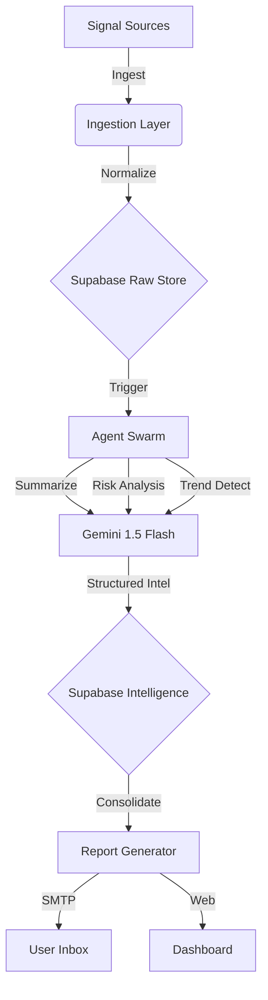

# DevPulseAI v2: Autonomous Technical Intelligence System


> **Automated Intelligence for the Modern Developer.**
> *Ingest. Analyze. Deliver.*

---

## ⚡ Overview
**DevPulseAI v2** is a cloud-native, agentic intelligence platform designed to keep developers ahead of the curve. It autonomously aggregates signals from specific high-value sources, processes them through a multi-agent LLM pipeline (**Google Gemini 1.5 Flash**), and delivers a curated, color-coded daily digest directly to your inbox.

Unlike generic newsletters, DevPulseAI is **deterministic, verifiable, and highly specific** to your tech stack.

### 🏗 Architecture
The system follows a strict **Micro-Agent** architecture orchestrated via **FastAPI** and persistent state in **Supabase**.



---

## 🧠 Core Features

### 1. Multi-Modal Ingestion
We treat every input as a "Signal". Adapters normalize diverse data streams into a unified schema.
*   **GitHub**: Trending Repositories & Release Notes.
*   **Hugging Face**: New Transformer Models & Datasets.
*   **ArXiv**: Latest AI/ML Research Papers.
*   **Medium**: Engineering Blogs (Netflix, Uber, Meta).
*   **X (Twitter)**: Key Opinion Leader (KOL) insights.

### 2. The "Tech Vibe" Daily Report
A highly styled, responsive HTML email that groups intelligence by category. No more wall of text.

| Category | Indicator | Description |
| :--- | :--- | :--- |
| **New Trends** | `assets/new-trends.png` | Aggregated patterns (e.g., "Rise of SLMs"). |
| **New Repos** | `assets/new-repos.png` | GitHub stars of the day (**Grey**). |
| **Updates** | `assets/updates.png` | New Hugging Face models (**Yellow**). |
| **Insights** | `assets/insights.png` | Deep dive ArXiv summaries (**Green**). |
| **Summary** | `assets/summary.png` | Executive TL;DR of the day. |

### 3. Agentic Pipeline
Every signal passes through three specialized agents:
*   **Summarization Agent**: Condenses long-form content.
*   **Relevance Agent**: Scores 0-100 based on developer profile.
*   **Risk Agent**: Flags breaking changes or security vulnerabilities (HIGH/LOW).

---

## 🚀 Deployment (100% Free Stack)

This project is optimized for **Render (Free Tier)** + **Cron-Job.org**.

### Step 1: Deploy to Render
1.  Fork this repo.
2.  Create a **New Web Service** on [Render](https://render.com).
3.  Connect your repo.
4.  **Runtime**: `Docker`.
5.  **Environment Variables**:
    ```bash
    SUPABASE_URL=...
    SUPABASE_KEY=...
    GEMINI_API_KEY=...
    SMTP_USER=...
    SMTP_PASSWORD=...
    ```

### Step 2: Automate
Since Free Tier sleeps, use [Cron-Job.org](https://cron-job.org) to wake it up.
*   **URL**: `https://your-app.onrender.com/report`
*   **Method**: `POST`
*   **Schedule**: `Daily @ 08:00 AM`

---

## 🛠 Local Development

```bash
# Clone the repo
git clone https://github.com/YourUsername/DevPulseAIv2.git

# Install dependencies
pip install -r requirements.txt

# Run the server
uvicorn app.api.main:app --reload
```

## 📂 Directory Structure

```text
devpulse_v2/
├── app/
│   ├── agents/         # LLM Logic (Summary, Risk, Trend)
│   ├── adapters/       # GitHub, ArXiv, HF Scrapers
│   ├── api/            # FastAPI Endpoints
│   ├── core/           # Config & Logging
│   ├── reports/        # HTML Generation Engine
│   └── persistence/    # Supabase Client
├── scripts/            # Cron & Verification Scripts
├── Dockerfile          # Container Definition
└── requirements.txt    # Python Deps
```

---

> **Built with ❤️ by Hill Patel.**
> *Powered by Google Gemini & Supabase.*
